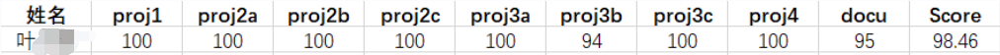

# TinyKV 2022

弱鸡第一次尝试分布式的实验，上了 TinyKV 2022 的车。

测试的时候 project3b 概率不过，并且我除了优化 nextIndex[] 的更新之外没做任何优化，性能也中规中矩。不过今年 PingCap 给分比较松，最后拿了 98.46 的高分，除了 project3b 和文档部分扣了点分，其余全部满分，还是很惊喜的。

- **正确率**：除了 project3b 的测试诡异莫测，其余 project 都很容易追踪。至少除了 project3 之外的本地测试点是能100%通过的，提交上去后正确率满分，并不是很意外。
- **性能**：我只优化了 nextIndex[] 的更新，并且没什么难度。本地跑测试点的时候也需要花费一定时间，性能不能算好，但最后也给了满分，这个我很意外。
- **文档**：文档拿了95分，我觉得已经很高了，因为文档我只是把我的理解、思路和一些重要函数的实现流程说明了一下，并没有涉及额外的优化与创新，能拿到这个分数我只能说感谢 PingCap。

## 项目文档

项目一共分为四个 project，每一个我都写了对应的文档，将我的思路、实现时踩的一些坑都记录了下来，后续也会慢慢细化，希望对你有帮助。

* [Standalone KV](doc/project1.md)
  * Implement a standalone storage engine.
  * Implement raw key-value service handlers.
* [Raft KV](doc/project2.md)
  * Implement the basic Raft algorithm.
  * Build a fault-tolerant KV server on top of Raft.
  * Add the support of Raft log garbage collection and snapshot.
* [Multi-raft KV](doc/project3.md)
  * Implement membership change and leadership change to Raft algorithm.
  * Implement conf change and region split on Raft store.
  * Implement a basic scheduler.
* [Transaction](doc/project4.md)
  * Implement the multi-version concurrency control layer.
  * Implement handlers of `KvGet`, `KvPrewrite`, and `KvCommit` requests.
  * Implement handlers of `KvScan`, `KvCheckTxnStatus`, `KvBatchRollback`, and `KvResolveLock` requests.

## 参考资料

- Raft：[Raft论文（中/英）](https://github.com/maemual/raft-zh_cn)
- Percolator：[Percolator论文（中/英）](https://www.luozhiyun.com/archives/609)
- 思路参考：[TinyKV 白皮书](https://github.com/Smith-Cruise/TinyKV-White-Paper)
