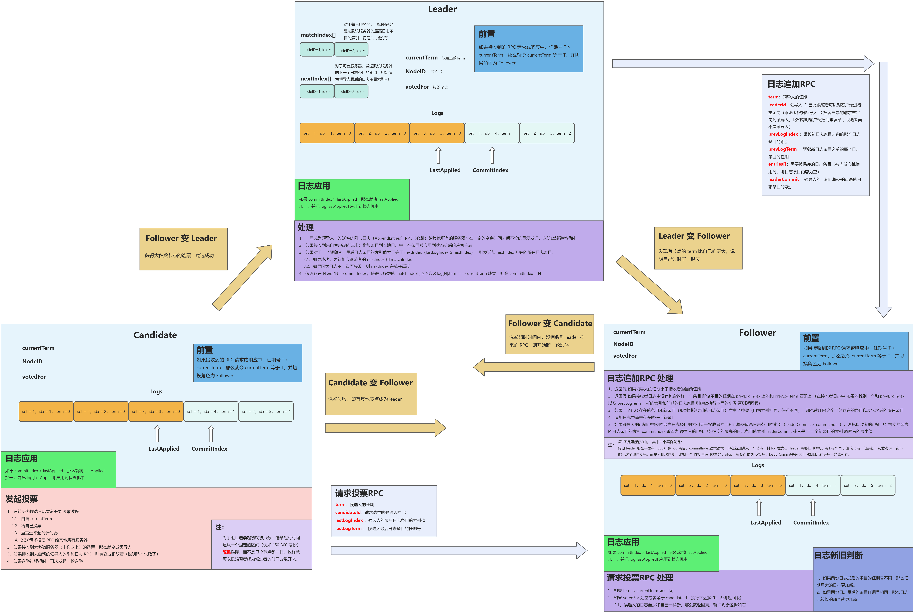
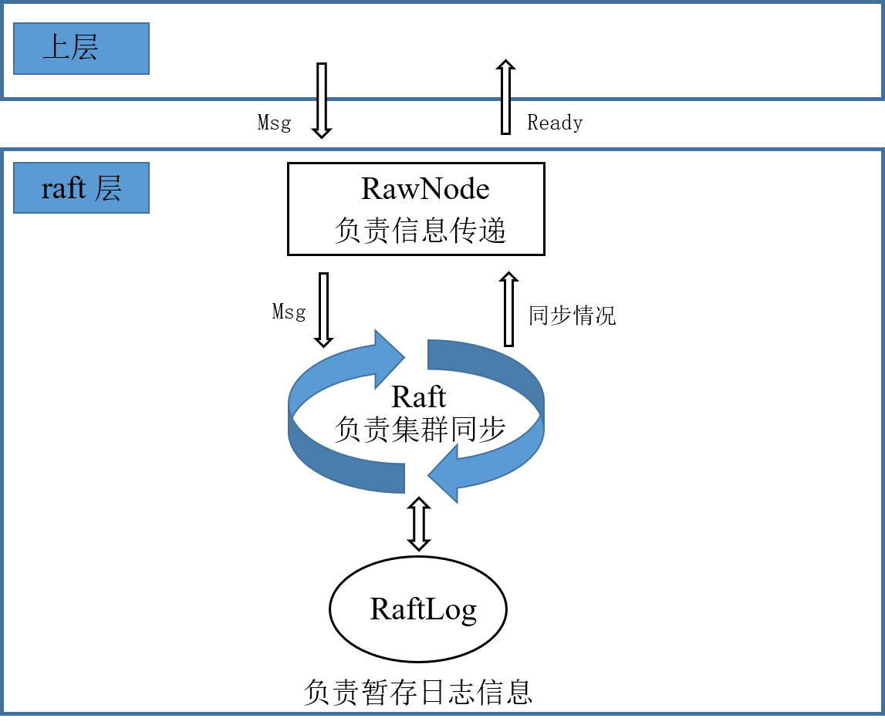
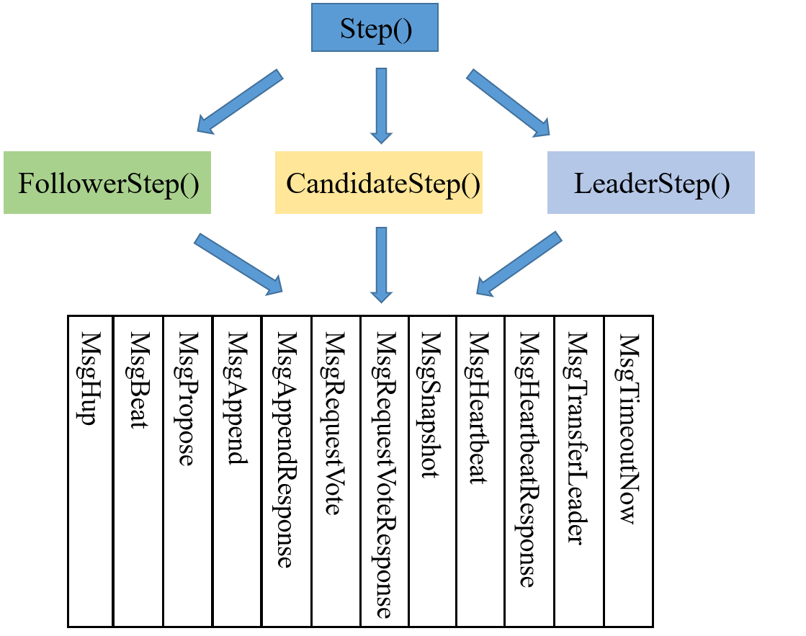

- [Project2](#project2)
	- [Raft 算法](#raft-算法)
	- [Project2A](#project2a)
		- [RaftLog](#raftlog)
		- [Raft](#raft)
			- [Msg 收发与处理](#msg-收发与处理)
				- [MsgHup](#msghup)
				- [MsgBeat](#msgbeat)
				- [MsgPropose](#msgpropose)
				- [MsgAppend](#msgappend)
				- [MsgAppendResponse](#msgappendresponse)
				- [MsgRequestVote](#msgrequestvote)
				- [MsgRequestVoteResponse](#msgrequestvoteresponse)
			- [推进器 Step()](#推进器-step)
			- [计时器 tick()](#计时器-tick)
		- [RawNode](#rawnode)
		- [2A 疑难杂症](#2a-疑难杂症)
	- [Project2B](#project2b)
		- [peer_msg_handler](#peer_msg_handler)
			- [proposeRaftCommand](#proposeraftcommand)
			- [HandleRaftReady](#handleraftready)
		- [PeerStorage](#peerstorage)
			- [SaveReadyState](#savereadystate)
			- [Append](#append)
		- [2B 疑难杂症](#2b-疑难杂症)
	- [Project2C](#project2c)
		- [快照流程](#快照流程)
		- [3C 疑难杂症](#3c-疑难杂症)

# Project2

在本节中，我们将实现一个基于 Raft 的高可用 KV 服务器，这不仅需要您实现Raft 算法（Project2A/C），还需要去实际使用它（Project2B）。整节分为三个小节，依次为：

- Implement the basic Raft algorithm；
- Build a fault-tolerant KV server on top of Raft；
- Add the support of raftlog GC and snapshot；

简单地来说，Project2A 用来实现基于 Raft 的同步过程，Project2B 用来实现 Raft 的上层调用与底层存储，Project2C 用来在前两者的基础上增加日志压缩和快照的功能。在进入代码实现之前，我们要先理解好 Raft 的思想。

## Raft 算法

Raft 是一个易于理解的一致性算法，其会保证结果的最终一致性。Raft 将一致性算法分解成了几个关键模块，如领导人选举、日志同步与安全性。

- **领导人选举**：当现存的领导人发生故障的时候，一个新的领导人需要被选举出来。
- **日志同步**：领导人必须从客户端接受日志条目，然后同步到集群中的其他节点，并强制要求其他节点的日志和自己保持一致，即强领导特性。
- **安全性**：如果有任何的服务器节点已经应用了一个确定的日志条目到它的状态机中，那么其他服务器节点不能在同一个日志索引位置应用一个不同的指令。

三大部分的细节在后续代码实现中再详细说明，这里要先理清 Raft 最为核心的运行逻辑，即 Leader、Follower、Candidate 三种角色的互相转换与 RPC 处理。在阐述三种角色关系之前，需要先清楚各节点上必须含有的字段。

首先是所有的节点上都应该含有的字段（不区分角色），其中包含了节点的基本信息、投票情况、日志记录、日志相关指针等等，分为持久性状态与易失性状态，如表所示：

| 字段        | 意义                                     | 状态   |
| :---------- | :--------------------------------------- | :----- |
| NodeID      | 节点 ID                                  | 持久性 |
| currentTerm | 节点当前的 Term                          | 持久性 |
| votedFor    | 当前 Term 内，节点把票投给了谁           | 持久性 |
| log[]       | 日志条目                                 | 持久性 |
| commitIndex | 已知已提交的最高的日志条目的索引         | 易失性 |
| lastApplied | 已经被应用到状态机的最高的日志条目的索引 | 易失性 |

其中，提交是指集群中 `半数以上` 的节点均同步了这条日志，才算作提交。

领导人唯一地从客户端接受指令，以日志条目的方式同步给集群中的其余节点，为了维持每个节点的同步信息，领导人需要额外两个字段去进行记录，如下：

| 字段         | 意义                                                         | 状态   |
| ------------ | ------------------------------------------------------------ | ------ |
| nextIndex[]  | 对于每个节点，待发送到该节点的下一个日志条目的索引，初值为领导人最后的日志条目索引 + 1 | 易失性 |
| matchIndex[] | 对于每个节点，已知的已经同步到该节点的最高日志条目的索引，初值为0，表示没有 | 易失性 |

Raft 通过基础的两个 RPC 来维持节点之间的通信，分别为日志追加 RPC（AppendEntries RPC）、请求投票 RPC（RequestVote RPC）。

- **AppendEntries RPC**：由领导人调用，发送给集群中的其他节点，用于日志条目的同步，同时也被当作心跳使用。（这里需要注意下，论文中 Heartbeat 和 AppendEntries RPC 是同一个 Msg，但在 TinyKV 中并不是，我们实现的过程中，Hearbeat 是一个独立的 Msg，和 AppendEntries RPC 不一样）
- **RequestVote RPC**：由候选人发送，用来征集选票。

两类 RPC 的收发与处理，每个角色均不一样。这里连同三种角色的互相转换、RPC 的处理、日志的应用等操作，整合为一张图，便于读者更清晰的理清它们之间的运行逻辑，如下：



## Project2A

> Implement the basic Raft algorithm.

本小节实验需要实现基础的 Raft 算法，且不需要考虑快照操作。我们共需要实现三个模块，分别为 RawNode、Raft 和 RaftLog，分别对应文件 `rawnode.go`、`raft.go` 和 `log.go` ，这三个模块，共同构成一层，我将其称为 `raft 层`。在具体实现之前，要先弄清三者的关系。

- **RawNode**：该模块用来接收上层传来的信息，将信息下传给 Raft 模块。比如，上层传递一个 Msg 给 RawNode，这个 Msg 可能是 心跳请求、日志提交请求、日志追加请求等等。然后 RawNode 收到这个 Msg 之后，将其交给 Raft 模块去处理。比如，上层交给 RawNode 一个日志提交请求，然后 RawNode 将其交给 Raft ，如果该节点是领导人，那么其就会追加这条日志，然后发送给其他节点进行同步。另外，RawNode 不仅用来接受请求然后传递给 Raft，还要用来收到 Raft 的同步结果然后传递给上层。RawNode 要负责检查 Raft 模块是否已有同步好的日志需要应用、是否有 Msg 需要发送、是否有日志需要持久化等等，然后把这些信息（Ready）交给上层，上层会据此进行处理。总的来说，RawNode 是 raft 层暴露给上层的一个模块，用来进行信息的传递。
- **Raft**：整个 raft 层最关键的就是它，它就是实现 Raft 算法的核心模块。其中，领导人选举、日志追加、角色转换等等均是在这里实现。Raft 模块会接受 RawNode 发来的信息，然后在进群中进行相关的同步操作，同步结果不需要主动返回给 RawNode，因为 RawNode 自己会进行检查。
- **RaftLog**：该模块用来暂存节点的日志条目，同时还要维护一些日志指针，如 committed、applied 等等。

总结一下，RawNode 是 raft 层中暴露在外面的模块，用于该层与上层的信息交互，Raft 模块是 raft 层中的核心模块，算法的核心逻辑均在该模块实现，RaftLog 用来暂存日志信息，并维护相关指针。三者的关系用图表示如下：



其中，Msg 不单指上层传来的请求，也有可能是其他节点发来的 Msg，比如两个 RPC，但这些 Msg 都是通过上层发送与接收的，然后 RawNode 将其传给 Raft 去处理。

了解了三者的关系后，从下往上开始代码实现。

### RaftLog

该模块要完善 `log.go` 文件，用来暂存节点的日志信息。核心结构体如下：

``` go
// RaftLog manage the log entries, its struct look like:
//
//  snapshot/first.....applied....committed....stabled.....last
//  --------|------------------------------------------------|
//                            log entries
//
// for simplify the RaftLog implement should manage all log entries
// that not truncated
type RaftLog struct {
	// storage contains all stable entries since the last snapshot.
	storage Storage

	// committed is the highest log position that is known to be in
	// stable storage on a quorum of nodes.
	committed uint64

	// applied is the highest log position that the application has
	// been instructed to apply to its state machine.
	// Invariant: applied <= committed
	applied uint64

	// log entries with index <= stabled are persisted to storage.
	// It is used to record the logs that are not persisted by storage yet.
	// Everytime handling `Ready`, the unstabled logs will be included.
	stabled uint64

	// all entries that have not yet compact.
	// 所有未被 compact 的 entry, 包括持久化与非持久化
	entries []pb.Entry

	// the incoming unstable snapshot, if any.
	// (Used in 2C)
	pendingSnapshot *pb.Snapshot

	// Your Data Here (2A).
	// 上一条追加的index，用于 follower 更新 committed
	lastAppend uint64
}
```

每个字段含义如下：

- **storage**：自从上次快照以来，所有的持久化条目；
- **commited**：论文中的 committedIndex，即节点认为已经提交的日志 Index；
- **applied**：论文中的 lastApplied，即节点最新应用的日志 Index；
- **stabled**：节点已经持久化的最后一条日志的 Index；
- **entries**：所有未被 compact 的日志，包括持久化与非持久化；
- **pendingSnapshot**：待处理快照，这个要等到 partC 才会使用；
- **lastAppend**：该字段是我自己加的，用于节点记录上一条追加的日志 Index，因为在 follower 更新自己的 committed 时，需要把 leader 传来的 committed 和其进行比较；

首先要完成 `newLog()`，该函数用于 Raft 节点生成一个上述结构体。由于是新建的，所以初始日志的相关信息均要从上面传来的 storage 中取，如下：

``` go
firstIndex, _ := storage.FirstIndex()
lastIndex, _ := storage.LastIndex()
entries, _ := storage.Entries(firstIndex, lastIndex+1)
hardState, _, _ := storage.InitialState()
```

然后将结构体的各字段填好即可。需要注意的是，在 ETCD 中，已持久化的条目和未持久化的条目是分开记录的，但本项目不需要这么麻烦，完全可以把二者一同记录在 entries[] 中，然后通过 stabled 指针来进行区分。

接下来要实现 `nextEnts()`，该方法用来返回所有已经提交但没有应用的日志，即 applied 和 commited 之间的日志。很好实现，只需要按照两个指针取出对应范围的 entries 即可。`LastIndex()` 用来获取节点的最后一条日志的 Index，`Term()` 用来获取对应 Index 的日志的 term，两个方法都很简单，这里不再赘述。

### Raft

该模块用于实现 Raft 算法的核心逻辑。整个实现过程被分为三个部分：

- Msg 的收发与处理；
- 推进器 Step() 的实现；
- 计时器 tick() 的实现；

其中，Msg 的收发与处理是整个 Raft 的核心部分，包括各种 RPC 的处理。而 Step 与 tick 分别起到推进和计时的作用。

- **Step(m pb.Message)**：该函数接收一个 Msg，然后根据节点的角色和 Msg 的类型调用不同的处理函数。上层 RawNode 发送 Msg 时，实际上就是将 Msg 传递给 Step()，然后进入 Msg 的处理模块，起到推进的作用。
- **tick()**：Raft 的时钟是一个逻辑时钟，上层通过不断调用 Tick() 来模拟时间的递增。每一次调用，节点都应该增加自己的 r.electionElapsed ，如果是 Leader，还应该增加自己的 r.heartbeatElapsed。接下来，根据节点的角色进行不同的处理。

#### Msg 收发与处理

Msg 分为 Local Msg 和 Common Msg。前者是本地发起的 Msg，多为上层传递下来的，比如提交条目、请求心跳、请求选举等等，这些 Msg 不会在节点之间传播，它们的 term 也相应的等于 0。后者就是节点之间发送的 Msg，用来集群之间的同步。

TinyKV 通过 pb.Message 结构定义了所有的 Msg，即共用一个结构体。所以结构体中的某些字段对于某些 MsgType 而言是多余的。这里将按照不同的 MsgType 来说明 Msg 是如何收发与处理的。

##### MsgHup

Local Msg，用于请求节点开始选举，仅仅需要一个字段。

| 字段    | 作用                  |
| ------- | --------------------- |
| MsgType | pb.MessageType_MsgHup |

当节点收到该 Msg 后，会进行相应的判断，如果条件成立，即刻开始选举。判断流程大致为：

1. 判断 r.Prs[r.id] 是否存在。由于网络原因，可能节点收到 MsgHup 之前，自己已经被移除了，此时直接返回即可；
2. 判断 region 中是否只有自己一个节点。如果是，不用选举，直接成为 Leader。这一步是应对测试集的，测试时，如果只有一个节点时，并不会触发 MsgRequestVoteResponse，导致选举无效，所以必须直接成为 Leader，跳过选举。如果不是，往下；
3. 角色转换为 Candidate，同时重置节点的相关字段；
4. 向其他所有节点发送 MsgRequestVote；

至此，MsgHup 的处理流程完毕。

##### MsgBeat

Local Msg，用于告知 Leader 该发送心跳了，仅仅需要一个字段。

| 字段    | 值                     |
| ------- | ---------------------- |
| MsgType | pb.MessageType_MsgBeat |

当 Leader 接收到 MsgBeat 时，向其他所有节点发送心跳。而非 Leader 接收到 MsgBeat 时，直接忽略。

##### MsgPropose

Local Msg，用于上层请求 propose 条目。字段如下：

| 字段    | 作用                      |
| ------- | ------------------------- |
| MsgType | pb.MessageType_MsgPropose |
| Entries | 要 propose 的条目         |
| To      | 发送给哪个节点            |

该 Msg 只有 Leader 能够处理，其余角色收到后直接返回 ErrProposalDropped。Leader 的处理流程如下：

1. 判断 r.leadTransferee 是否等于 None，如果不是，返回 ErrProposalDropped，因为此时集群正在转移 Leader。如果是，往下；
2. 把 m.Entries 追加到自己的 Entries 中；
3. 向其他所有节点发送追加日志 RPC，即 MsgAppend，用于集群同步；
4. 如果集群中只有自己一个节点，则直接更新自己的 committedIndex；

至此，MsgPropose 处理流程完毕。

##### MsgAppend

Common Msg，用于 Leader 给其他节点同步日志条目，字段如下：

| 字段    | 作用                                                      |
| ------- | --------------------------------------------------------- |
| MsgType | pb.MessageType_MsgAppend                                  |
| To      | 目标节点                                                  |
| From    | 当前节点（LeaderId）                                      |
| Term    | 当前节点的 Term                                           |
| LogTerm | 要发送的条目的前一个条目的 Term，即论文中的 prevLogTerm   |
| Index   | 要发送的条目的前一个条目的 Index，即论文中的 prevLogIndex |
| Entries | 要发送的日志条目                                          |
| Commit  | 当前节点的 committedIndex                                 |

发送：

1. 前置判断：如果要发送的 Index 已经被压缩了，转为发送快照，否则往下；
2. 当 Leader 收到 MsgPropose 后，它会给其他所有节点发送 MsgAppend；
3. 当 MsgAppend 被接收者拒绝时，Leader 会调整 next，重新进行前置判断，如果无需发快照，则按照新的 next 重新发送 MsgAppend ；

接收与处理：

1. 判断 Msg 的 Term 是否大于等于自己的 Term，是则更新，否则拒绝；
2. 拒绝，如果 prevLogIndex > r.RaftLog.LastIndex()。否则往下；
3. 拒绝，如果接收者日志中没有包含这样一个条目：即该条目的任期在 prevLogIndex 上能和 prevLogTerm 匹配上。否则往下；
4. 追加新条目，同时删除冲突条目，冲突条目的判别方式和论文中的一致；
5. 记录下当前追加的最后一个条目的 Index。因为在节点更新 committedIndex 时，要比较 Leader 已知已经提交的最高的日志条目的索引 m.Commit 或者是上一个新条目的索引，然后取两者的最小值。为了记录这个值，我在 RaftLog 中新增了一个字段 lastAppend；
6. 接受；

其中，不管是接受还是拒绝，都要返回一个 MsgAppendResponse 给 Leader，让 Leader 知道追加是否成功并且更新相关信息。

##### MsgAppendResponse

Common Msg，用于节点告诉 Leader 日志同步是否成功，和 MsgAppend 对应，字段如下：

| 字段    | 值                                                         |
| ------- | ---------------------------------------------------------- |
| MsgType | pb.MessageType_MsgAppendResponse                           |
| Term    | 当前节点的 Term                                            |
| To      | to                                                         |
| Reject  | 是否拒绝                                                   |
| From    | 当前节点的 Id                                              |
| Index   | r.RaftLog.LastIndex()；该字段用于 Leader 更快地去更新 next |

发送：

1. 不管节点接受或是拒绝，都要发送一个 MsgAppendResponse 给 Leader，调整 Reject 字段即可，其他字段固定；

接收与处理：

1. 只有 Leader 会处理该 Msg，其余角色直接忽略； 
2. 如果被 reject 了，那么重置 next。重置规则为将旧的 next --，然后比较 m.Index + 1，最后取小的那个赋值给 next，然后重新进行日志 / 快照追加；
3. 如果没有 reject，则更新 match 和 next。next 赋值为 m.Index + 1，match 赋值为  next - 1 ；
4. 按照论文的思路更新 commit。即：假设存在 N 满足N > commitIndex，使得大多数的 matchIndex[i] ≥ N以及log[N].term == currentTerm 成立，则令 commitIndex = N。为了快速更新，这里先将节点按照 match 进行了递增排序，这样就可以快速确定 N 的位置。核心代码如下：

``` go
func (r *Raft) updateCommitIndex() uint64{
	// 确定 match 切片
    // ...
	sort.Sort(match)
	maxN := match[(len(r.Prs)-1) / 2]
	N := maxN
	for ;N > r.RaftLog.committed; N-- {
		if term, _ := r.RaftLog.Term(N) ; term == r.Term {
			break
		}
	}
	// ...
}
```

##### MsgRequestVote

Common Msg，用于 Candidate 请求投票，字段如下：

| 字段    | 值                            |
| ------- | ----------------------------- |
| MsgType | pb.MessageType_MsgRequestVote |
| Term    | 当前节点的 Term               |
| LogTerm | 节点的最后一条日志的 Term     |
| Index   | 节点的最后一条日志的 Index    |
| To      | 发给谁                        |
| From    | 当前节点的 Id                 |

发送：

1. 当节点开始选举并成为 Candidate 时，立刻向其他所有节点发送 MsgRequestVote；

接收与处理：

1. 判断 Msg 的 Term 是否大于等于自己的 Term，是则更新，否则拒绝；
2. 如果 votedFor 不为空或者不等于 candidateID，则说明该节点以及投过票了，直接拒绝。否则往下；
3. Candidate 的日志至少和自己一样新，那么就给其投票，否者拒绝。新旧判断逻辑如下：
   - 如果两份日志最后的条目的任期号不同，那么任期号大的日志更加新
   - 如果两份日志最后的条目任期号相同，那么日志比较长的那个就更加新；

Candidate 会通过 r.votes 记录下都有哪些节点同意哪些节点拒绝，当同意的票数过半时，即可成为 Leader，当拒绝的票数过半时，则转变为 Follower。

##### MsgRequestVoteResponse

Common Msg，用于节点告诉 Candidate 投票结果，字段如下：

| 字段    | 值                                     |
| ------- | -------------------------------------- |
| MsgType | pb.MessageType_MsgRequestVoteResponsev |
| Term    | 当前节点的 Term                        |
| Reject  | 是否拒绝                               |
| To      | 发给谁                                 |
| From    | 当前节点 Id                            |

发送：

1. 节点收到 MsgRequestVote 时，会将结果通过 MsgRequestVoteResponse 发送给 Candidate；

接收与处理：

1. 只有 Candidate 会处理该 Msg，其余节点收到后直接忽略；
2. 根据 m.Reject 更新 r.votes[m.From]，即记录投票结果；
3. 算出同意的票数 agrNum 和拒绝的票数 denNum；
4. 如果同意的票数过半，那么直接成为 Leader；
5. 如果拒绝的票数过半，那么直接成为 Follower；

**MsgSnapshot**

Common Msg，用于 Leader 将快照发送给其他节点，Project2C 中使用。字段如下：

| 字段     | 值                         |
| -------- | -------------------------- |
| MsgType  | pb.MessageType_MsgSnapshot |
| Term     | 当前节点的 Term            |
| Snapshot | 要发送的快照               |
| To       | 要发给谁                   |
| From     | 当前节点 ID                |

快照部分在 Project2C 中才会实现，所以该 Msg 在 Project2C 处再详述。

**MsgHeartbeat**

Common Msg，即 Leader 发送的心跳。不同于论文中使用空的追加日志 RPC 代表心跳，TinyKV 给心跳一个单独的 MsgType。其字段如下：

| 字段    | 值                          |
| ------- | --------------------------- |
| MsgType | pb.MessageType_MsgHeartbeat |
| Term    | 当前节点的 Term             |
| Commit  | util.RaftInvalidIndex       |
| To      | 发给谁                      |
| From    | 当前节点 ID                 |

其中，Commit 字段必须固定为 util.RaftInvalidIndex，即 0，否则无法通过 Msg 的初始化检查。

发送：

1. 每当 Leader 的 heartbeatTimeout 达到时，就会给其余所有节点发送 MsgHeartbeat；

接收与处理：

1. 判断 Msg 的 Term 是否大于等于自己的 Term，是则更新，否则拒绝；
2. 重置选举计时  r.electionElapsed
3. 发送 MsgHeartbeatResponse

**MsgHeartbeatResponse**

Common Msg，即节点对心跳的回应。字段如下：

| 字段    | 值                                  |
| ------- | ----------------------------------- |
| MsgType | pb.MessageType_MsgHeartbeatResponse |
| Term    | 当前节点的 Term                     |
| To      | 发给谁                              |
| From    | 当前节点 ID                         |
| Commit  | 当前节点的 committedIndex           |

其中，Commit 字段用于告诉 Leader 自己是否落后。

发送：

1. 当节点收到 MsgHeartbeat 时，会相应的回复 MsgHeartbeatResponse；

接收与处理：

1. 只有 Leader 会处理 MsgHeartbeatResponse，其余角色直接忽略；
2. 通过 m.Commit 判断节点是否落后了，如果是，则进行日志追加；

**MsgTransferLeader**

Local Msg，用于上层请求转移 Leader，Project3 使用。字段如下：

| 字段    | 值                               |
| ------- | -------------------------------- |
| MsgType | pb.MessageType_MsgTransferLeader |
| From    | 由谁转移                         |
| To      | 转移给谁                         |

详细说明将在 Project3 章节叙述。

**MsgTimeoutNow**

Local Msg，节点收到后清空 r.electionElapsed，并即刻发起选举，字段如下：

| 字段    | 值                           |
| ------- | ---------------------------- |
| MsgType | pb.MessageType_MsgTimeoutNow |
| From    | 由谁发的                     |
| To      | 发给谁的                     |

#### 推进器 Step()

Step() 作为驱动器，用来接收上层发来的 Msg，然后根据不同的角色和不同的 MsgType 进行不同的处理。首先，通过 switch-case 将 Step() 按照角色分为三个函数，分别为：FollowerStep() 、CandidateStep()、LeaderStep() 。接着，按照不同的 MsgTaype，将每个 XXXStep() 分为 12 个部分，用来处理不同的 Msg。

实现框架非常直观，如下图所示：



接着，调用上一模块（Msg 的收发与处理）即可。

#### 计时器 tick()

该函数起到计时器的作用，即逻辑时钟。每调用一次，就要增加节点的心跳计时（ r.electionElapsed），如果是 Leader，就要增加自己的选举计时（ r.heartbeatElapsed），然后，应按照角色进行对应的操作。

**Follower**

选举计时增加后，判断是达到选举超时（electionTimeout），如果否，不做任何处理。如果是，则重置选举计时，然后通过 Step() 发起选举。

``` go
case StateFollower:
// 选举超时
if r.electionElapsed >= r.electionTimeout{
    // 发起选举、重置选举计时
    r.electionElapsed = 0
    err := r.Step(pb.Message{MsgType: pb.MessageType_MsgHup})
    if err != nil {
        return
    }
}
```

**Candidate**

同 Follower，如果选举超时，那么通过 Step() 发起选举。

``` go
case StateCandidate:
// 选举超时
if r.electionElapsed >= r.electionTimeout{
    // 重新选举、重置选举计时
    r.electionElapsed = 0
    err := r.Step(pb.Message{MsgType: pb.MessageType_MsgHup})
    if err != nil {
        return
    }
}
```

**Leader**

不同于前两者，Leader 所做的处理要更多。

1. 增加心跳计时（r.heartbeatElapsed ++）；
2. 获取收到的 心跳回应 数量，即有多少个心跳被正确的回应，这一步用来应对网络分区；
3. 如果选举超时，进入下述步骤：
   1. 判断心跳回应数量有没有超过集群的一半。如果有，则说明该 Leader 被分在了少数的一方，应当立刻重新开始选举。如果没有，则继续保持 Leader 的状态；
   2. 判断 r.leadTransferee 是否为 None，如果是，则说明 Leader 转移在一个选举周期内还未完成，很有肯能是目标节点挂了，因此需要放弃转移，将其置空；
4. 如果心跳超时，那么就重置像心跳计时，然后通过 Step() 传递一个 MsgBeat，使 Leader 向其他所有节点发送心跳；

```go
case StateLeader:
    r.heartbeatElapsed ++
    hbrNum := len(r.heartbeatResp)
    total := len(r.Prs)
    // 选举超时
    if r.electionElapsed >= r.electionTimeout{
        r.electionElapsed = 0
        r.heartbeatResp = make(map[uint64] bool)
        r.heartbeatResp[r.id] = true
        // 心跳回应数不超过一半，说明成为孤岛，重新开始选举
        if hbrNum*2 <= total {
            r.startElection()
        }
        // leader 转移失败，目标节点可能挂了，放弃转移
        if r.leadTransferee != None {
            r.leadTransferee = None
        }
    }
    // 心跳超时
    if r.heartbeatElapsed >= r.heartbeatTimeout {
        // 发送心跳
        r.heartbeatElapsed = 0
        err := r.Step(pb.Message{MsgType: pb.MessageType_MsgBeat})
        if err != nil {
            return
        }
    }
```

对于通过判断心跳数是否过半来应对网络分区，有两个问题值得思考。

> 被孤立的 Leader 因为一直未收到过半心跳导致 term 持续增加？

- 没错，被孤立的 Leader 的 term 会持续增加。因为判断心跳回应是否过半应该选举超时（r.electionElapsed >= r.electionTimeout）时判断，这样也就是每 r.electionTimeout 自增一次 term。
- 对于正常的 Follower 来说，如果收到 heartbeat 那么就清空 r.electionElapsed，因此如果集群正常运转那么就不会再发生选举，从而 term 不会自增。

> 被孤立的 Leader 因为 term 持续增加，那么当它回归集群时，会不会因为 term 过大直接选举成新Leader？

- 不会，因为给 Candidate 投票是看**日志**的新旧，而不是节点 term 的大小，旧 Leader 的日志落后，因此不会被投票。

至此，Raft 模块的核心逻辑梳理完毕。

#### 测试

Raft 模块的测试和上层（RawNode）没有任何关系，测试代码直接新建多个 Raft 对象来模拟多节点，可以说是自己玩自己的。以 TestLeaderElection2AA 代码来说明：

``` go
func TestLeaderElection2AA(t *testing.T) {
	var cfg func(*Config)
	tests := []struct {
		*network
		state   StateType
		expTerm uint64
	}{
		{newNetworkWithConfig(cfg, nil, nil, nil), StateLeader, 1},
		{newNetworkWithConfig(cfg, nil, nil, nopStepper), StateLeader, 1},
		{newNetworkWithConfig(cfg, nil, nopStepper, nopStepper), StateCandidate, 1},
		{newNetworkWithConfig(cfg, nil, nopStepper, nopStepper, nil), StateCandidate, 1},
		{newNetworkWithConfig(cfg, nil, nopStepper, nopStepper, nil, nil), StateLeader, 1},
	}

	for i, tt := range tests {
		tt.send(pb.Message{From: 1, To: 1, MsgType: pb.MessageType_MsgHup})
		sm := tt.network.peers[1].(*Raft)
		if sm.State != tt.state {
			t.Errorf("#%d: state = %s, want %s", i, sm.State, tt.state)
		}
		if g := sm.Term; g != tt.expTerm {
			t.Errorf("#%d: term = %d, want %d", i, g, tt.expTerm)
		}
	}
}
```

整体上看，测试集共有 5 组测试，每组都有一个 network，而这个 network 实际上就是多个 Raft 实例。newNetworkWithConfig 的代码如下：

```go
func newNetworkWithConfig(configFunc func(*Config), peers ...stateMachine) *network {
	size := len(peers)
	peerAddrs := idsBySize(size)

	npeers := make(map[uint64]stateMachine, size)
	nstorage := make(map[uint64]*MemoryStorage, size)

	for j, p := range peers {
		id := peerAddrs[j]
		switch v := p.(type) {
		case nil:
			nstorage[id] = NewMemoryStorage()
			cfg := newTestConfig(id, peerAddrs, 10, 1, nstorage[id])
			if configFunc != nil {
				configFunc(cfg)
			}
			sm := newRaft(cfg)
			npeers[id] = sm
		case *Raft:
			v.id = id
			npeers[id] = v
		case *blackHole:
			npeers[id] = v
		default:
			panic(fmt.Sprintf("unexpected state machine type: %T", p))
		}
	}
	return &network{
		peers:   npeers,
		storage: nstorage,
		dropm:   make(map[connem]float64),
		ignorem: make(map[pb.MessageType]bool),
	}
}
```

其实，stateMachine 是一个接口，接口方法为 Step() 和 readMessage()，而这两个方法都被 Raft 实现了，因为 stateMachine 就是 Raft。上述代码就是根据传入 peer 的 type 来确定 Raft 实例的初始化信息。如果是 nil，那就是正常的节点，如果是 blackHole (nopStepper)，那可以理解为节点宕机了。随后，把这些 Raft 实例加到一个 map 中，就构成一个 network 了。

tt.send() 代码如下：

```go
func (nw *network) send(msgs ...pb.Message) {
	for len(msgs) > 0 {
		m := msgs[0]
		p := nw.peers[m.To]
		p.Step(m)
		msgs = append(msgs[1:], nw.filter(p.readMessages())...)
	}
}
```

其中，p.Step() 就是上述实现的 Step()。因此，测试代码就是给节点 1 发送一条 MsgHup，让其开始选举。当然这个发送也是完全模拟的，没有经过 rpc，直接通过 Step() 来找接收者得到 msg。可以看到，send() 是一个循环，只有 msg[]  中有消息，那就一直处理。当节点 1 收到 MsgHup 后，开始选举，就会发送给其他节点 msg，而这些 msg 就 append 在 msg[] 中，因此 send() 紧接着就会把它发出去。注意，send() 不是针对于某个节点，而是要处理完 network 中所有节点的所有 msg，也就是完成一轮 Raft 同步。

最后，Raft 同步之后，这些节点的角色就成功了，如果目标节点的角色和预定的一致，那么测试通过。

### RawNode

RawNode 作为一个信息传递的模块，主要就是上层信息的下传和下层信息的上传。其核心为一个 Ready 结构体。

``` go
// Ready encapsulates the entries and messages that are ready to read,
// be saved to stable storage, committed or sent to other peers.
// All fields in Ready are read-only.
type Ready struct {
	// The current volatile state of a Node.
	// SoftState will be nil if there is no update.
	// It is not required to consume or store SoftState.
	*SoftState  // 需要被持久化，存粹用在HasReady()中做判断

	// The current state of a Node to be saved to stable storage BEFORE
	// Messages are sent.
	// HardState will be equal to empty state if there is no update.
	pb.HardState

	// Entries specifies entries to be saved to stable storage BEFORE
	// Messages are sent.
	Entries []pb.Entry // 待持久化

	// Snapshot specifies the snapshot to be saved to stable storage.
	Snapshot pb.Snapshot

	// CommittedEntries specifies entries to be committed to a
	// store/state-machine. These have previously been committed to stable
	// store.
	CommittedEntries []pb.Entry  // 待 apply

	// Messages specifies outbound messages to be sent AFTER Entries are
	// committed to stable storage.
	// If it contains a MessageType_MsgSnapshot message, the application MUST report back to raft
	// when the snapshot has been received or has failed by calling ReportSnapshot.
	Messages []pb.Message  // 待发送
}
```

RawNode 通过 HasReady() 来判断 Raft 模块是否已经有同步完成并且需要上层处理的信息，包括：

- 是否有需要持久化的状态；
- 是否有需要持久化的条目；
- 是否有需要应用的快照；
- 是否有需要应用的条目；
- 是否有需要发送的 Msg

其中，最后一点的 Msg，就是 Raft 模块中节点间相互发送的 Msg。也就是说，节点间发送的 Msg 是通过 RawNode 先发送给上层，然后上层在将其发送给对应节点的。

如果 HasReady() 返回 true，那么上层就会调用 Ready() 来获取具体要做的事情，和上述 HasReady() 的判断一一对应。该方法直接调用 rn.newReady() 生成一个 Ready() 结构体然后返回即可。

当上层处理完 Ready 后，调用 Advance() 来推进整个状态机。Advance() 的实现就按照 Ready 结构体一点点更改 RawNode 的状态即可，包括：

- prevHardSt 变更；
- stabled 指针变更；
- applied 指针变更；
- 清空 rn.Raft.msgs；
- 丢弃被压缩的暂存日志；
- 清空 pendingSnapshot；

RawNode 的核心极为上述三个方法。至于 HasReady() 什么时候调用，那就是上层的事了。

至此，Project2A 实现完成。测试逻辑也很简单，都是自己玩自己的，这里就不说了。

### 2A 疑难杂症

**测试集中 becomeCandidate 和发送投票请求是分开的**

- 际上，一旦成为 candidate，会立刻向所有节点发送请求，所以刚开始我把两者合在一起了。但是在测试集的想法中，becomeCandidate 和 选举 是分开的，只有进入选举时会发投票请求，而不是 becomeCandidate  就立马发送。如果发请求被整合在 becomeCandidate ，那么就会重复发一遍。

**随机选举时间问题**

- 如果 et 太小，会过早开始选举，导致 term 比测试预期大。如果太大，会很晚发生选举，导致 term 比测试预期小。而且如果按照etcd那样一直递增，最后时间会非常长，直接卡住。我最后把它限制在 10~20 之间，通过测试。

**leader 更新 committed 之后要告知 follower**

- eader 收到 appendResp 后，会相应的更新自己的 committed，但是更新之后一定要把更新结果告知`全部` follower，即另外发送一个 appendResp 。如果不这样的话，最后一轮完成后，集群的 committed 会不同步。并且为了防止死循环，leader 只能在 committed 发生变化的时候去通知 follower。

**测试要求 msg 是nil，而不是空切片**

- TestRawNodeRestartFromSnapshot2C 中，want 里的 msg 为 nil，即测试点预期 newRaft 处的 msg 应该为 nil，而不是 make 一个空切片。

## Project2B

> Build a fault-tolerant KV server on top of Raft.

project2b 实现了 rawNode 之上的上层应用，即真正开始多线程集群操作，引入了 peer 和 region 的概念。同时，除了实现上层的调用，project2b 还需要通过调用 RaftStorage 中的接口真正实现写落盘。

store、peer、region 三者的关系如下：


- Store：每一个节点叫做一个 store，也就是一个节点上面只有一个 Store。代码里面叫 RaftStore，后面统一使用 RaftStore 代称。
- Peer：一个 RaftStore 里面会包含多个 peer，一个 RaftStore 里面的所有 peer 公用同一个底层存储，也就是多个 peer 公用同一个 badger 实例。
- Region：一个 Region 叫做一个 Raft group，即同属一个 raft 集群，一个 region 包含多个 peer，这些 peer 散落在不同的 RaftStore 上。

这里将 Rawnode-Raft-RaftLog 统称为 raft 层，把要实现的部分称为 peer 层。peer 层首先接收来自 client 的 RaftCmdRequest，其中包含着不同的`命令请求`，接着它会把这些请求逐一以 entry 的形式传递给 raft 层，当然，这个 peer 应该是 Leader，不然 client 会找下一个 peer 继续试。raft 层收到条目后，会在集群内部进行同步，这就是 project2a 的内容。同步的过程中，peer 层会不时询问 raft 层有哪些已经同步好的 entry 可以拿来应用（执行）？哪些 entry 需要持久化？有没有快照需要应用？等等。三层的交互如下图所示：


该模块要完善两个文件，分别为 `peer_msg_handler.go` 和 `peer_storage.go` 

### peer_msg_handler

该文件中需要完善两个方法，分别为 proposeRaftCommand 和 HandleRaftReady，前者用来将 client 的请求递交给下层，后者用来处理下层传来的 Ready。

#### proposeRaftCommand

该方法会将 client 的请求包装成 entry 传递给 raft 层。client 会传来一个 msg（类型为 *raft_cmdpb.RaftCmdRequest）。其中，该结构中包含了 Requests 字段和 AdminRequest 字段，即两种命令请求。在 project2B 中，暂时只用到 Requests 字段。核心分为两步：

1. 通过 msg.Marshal() 将请求包装成字节流，然后通过 d.RaftGroup.Propose() 将该字节流包装成 entry 传递给下层；
2. 为 msg 创建一个 proposal，即它的 index、term 以及 callback。在后续相应的 entry 执行完毕后，响应该 proposal，即 callback.Done( )；

proposals 是一个 []*proposal，每一个 proposal 均有 term、index、callback。当上层想要让 peer 执行一些命令时，会发送一个 RaftCmdRequest 给该 peer，而这个 RaftCmdRequest 里有很多个 Request，需要底层执行的命令就在这些 Requset 中。这些 Request 会被封装成一个 entry 交给 peer 去在集群中同步。当 entry 被 apply 时，对应的命令就会被执行。

那么问题来了，上层怎么知道底层的这些命令真的被执行并且得到命令的执行结果呢？这就是 callback 的作用。每当 peer 接收到 RaftCmdRequest 时，就会给里面的每一个 Request 一个 callback，然后封装成 proposal，其中 term 就为该 Request 对应 entry 生成时的 term 以及 index。当 Request 被执行后（也就是 entry 被 commit 并 apply），调用 callback.Done()。

当 rawNode 返回一个 Ready 回去时，说明上述那些 entries 已经完成了同步，因此上层就可以通过 HandleRaftReady 对这些 entries 进行 apply（即执行底层读写命令）。每执行完一次 apply，都需要对 proposals 中的相应 Index 的 proposal 进行 callback 回应（调用 cb.Done()），表示这条命令已经完成了（如果是 Get 命令还会返回取到的 value），然后从中删除这个 proposal。

提一嘴，proposeRaftCommand() 被封装在了 HandleMsg() 中，后者不需要我们实现，但建议去看下。

#### HandleRaftReady

该方法用来处理 rawNode 传递来的 Ready。主要分为 5 步：

1. 判断是否有新的 Ready，没有就什么都不处理；
2. 调用 SaveReadyState 将 Ready 中需要持久化的内容保存到 badger。如果 Ready 中存在 snapshot，则应用它；
3. 然后调用 d.Send() 方法将 Ready 中的 msg 发送出去；
4. 应用 Ready 中的 CommittedEntries；
5. 调用 d.RaftGroup.Advance() 推进 RawNode；

其中，d.Send() 不用我们实现，但建议看一下。它会通过管道将 msg 发给对应的节点，然后节点的 **raftWorker**（raft_worker.go）通过 run() 来持续监听收到的 msg，接着调用 HandleMsg() 来处理它。至此，节点间的 msg 收发流程就闭环了。

msg 的收发基本结束，接下来就是将其中可能的 entry 给存盘了。

### PeerStorage

PeerStorage 负责该 peer 的存储。TinyKV 这里提供了两个 badger 实例，分别是 raftDB 和 kvDB，每个实例负责存储不同的内容：

raftDB 存储：

- Ready 中需要 stable 的 entries。
- RaftLocalState

kvDB 存储：

- key-value
- RaftApplyState
- RegionLocalState

#### SaveReadyState

该方法用来持久化 Ready 中的数据。

1. 通过 raft.isEmptySnap() 方法判断是否存在 Snapshot，如果有，则调用 ApplySnapshot() 方法应用（2C）；
2. 调用 Append() 将需要持久化的 entries 保存到 raftDB；
3. 保存 ready 中的 HardState 到 ps.raftState.HardState，注意先使用 raft.isEmptyHardState() 进行判空；
4. 持久化 RaftLocalState 到 raftDB；
5. 通过  raftWB.WriteToDB 和 kvWB.WriteToDB 进行底层写入。 

#### Append

该方法供 SaveReadyState() 调用，负责将 Ready 中的 entries 持久化到 raftDB 中去，然后更新 RaftLoaclState 的状态。同时，如果底层存储有冲突条目，则将其删除。

至此，Project2B 实现完成。

但这里要明确一下，stable 和 applied 的关系，也就是持久化和应用的关系。在我的实现中，二者是没有关系的，或者说 stable 是更快的，一旦有 entry 进来，就需要 stable。为了说清，这里直接放三段代码：

首先是 raftLog 的 appendEntry，很简单，就是把新来的 entry 加到切片中，是内存中的操作：

``` go
func (r *Raft) appendEntry(es []*pb.Entry){
	lastIndex := r.RaftLog.LastIndex()
	for i := range es {
		es[i].Term = r.Term
		es[i].Index = lastIndex + 1 + uint64(i)
		r.RaftLog.entries = append(r.RaftLog.entries,*es[i])
	}
	r.Prs[r.id].Match = r.RaftLog.LastIndex()
	r.Prs[r.id].Next = r.Prs[r.id].Match + 1
	return
}
```

接着是 newReady，看看它是怎么取出要持久化的日志的（Entries 字段），很简单：

```go
func (rn *RawNode)newReady() Ready {
    // ...
	rd := Ready{
		Entries:          r.RaftLog.unstableEntries(),
		CommittedEntries: r.RaftLog.nextEnts(),
		Messages:         r.msgs,
	}
    // ...
}
```

进入 unstableEntries 看一看：

``` go
func (l *RaftLog) unstableEntries() []pb.Entry {
    // ...
	return l.entries[l.stabled-firstIndex+1:]
    // ...
}
```

三者结合起来看，思路很明晰了，stable 全程和 apply 没有关系。在 peer 层的轮询下，rowNode 会持续调用 newReady() 返回要持久化的日志，而一旦 raftLog 的日志切片中加入了新 entry，就立马返回上去，不管它有没有被 apply。因此，持久化和 apply，我认为是两个不相干的操作。

实际上，entry 更快的持久化是没有什么坏处的，相当于每当节点收到新的 entrty 就立刻让它落盘。

### 2B 疑难杂症

**find no region for key xxx**

- 感觉这是一个大坑。刚开始我以为，上层在 newRaft 时，所有的 peer ID 都会在传入的那个 c.peers  里，然后 Prs 中的成员我就直接按照 c.peers 来定了，后来发现一直是空，就很懵。后来发现初始集群成员都是配置在 confState 中（c.Storage.InitialState() 获取），所以要按这个来初始化成员信息。

**apply 与 exec entry**

- 每一个需要 apply 的条目实际就是一条需要执行给底层存储的命令请求。请求被编码在 entry.Data 中，通过 msg.Unmarshal 方法把 Data 解码成对底层的请求（Requests 与  AdminRequest ）。接着对请求中的命令（Get / PUT / Delete / Snap ...）进行相应的执行即可。也即，entry 中的命令是在其被 apply 时执行的，所以这一步要在 HandleRaftReady 中处理。

**p.cb.Txn**

- 在完成 Snap 条目的 apply 之后，需要给 p.cb.Txn 赋值一个可读事务。因为在 cluster.go 的 Scan() 方法中，会传给 Raft 一个 SnapCmd，然后通过回应的 txn 来构造迭代器。如果在执行完 SnapCmd 后没有给 p.cb.Txn 赋值，那么就会报 nil pointer 错误，如下：


- 给 txn 赋值一个只读事务就行了。

``` go
p.cb.Txn = d.peerStorage.Engines.Kv.NewTransaction(false)
p.cb.Done(cmdResp)
```

**leader 是直接可以成为 candidate 的**

-  leader 发现自己处于少数的网络分区中时，即刻开始选举，成为 candidate，因此在 becomeCandidate 中不能拒绝 leader 的转变。

## Project2C

> Add the support of Raft log garbage collection and snapshot.

project2c 在 project2b 的基础上完成集群的快照功能。分为五个部分：快照生成，快照分发，快照接收，快照应用，日志压缩。

### 快照流程

首先是快照生成与快照分发：

1. 当 Leader 发现要发给 Follower 的 entry 已经被压缩时（ Next < r.RaftLog.FirstIndex() )，就会通过 r.RaftLog.storage.Snapshot() 生成一份 Snapshot，并将生成的 Snapshot 发送给对应节点。
2. 因为 Snapshot 有点大，r.RaftLog.storage.Snapshot( ) 不是瞬时完成的，而是异步的，通过发送 RegionTaskGen 到 region_task.go 中处理，会异步地生成 Snapshot。第一次调用 r.RaftLog.storage.Snapshot( ) 时，很可能因为时间原因 Snapshot 未生成完毕，其会返回一个 nil，这时候 leader 需要停止快照发送，然后等到下一次需要发送时再次调用 ，r.RaftLog.storage.Snapshot( ) 生成，这时如果其在之前已经生成好了，直接返回那个 Snapshot，然后 leader 将其发送给 follower。
3. 每个节点有个字段叫 pendingSnapshot，可以理解为待应用的 Snapshot，如果 leader 发快照时pendingSnapshot 有值，那就直接发这个，否者通过第2步生成一个新的发过去。
4. 快照发送的底层实现不用管，TinyKV 已经把 Snapshot 的发送封装成和普通 Msg 那样了，用同样的接口就行。但是底层发送 Snapshot 和发送普通 Msg 的逻辑却不一样，前者像 raft 论文写的那样实现了分块发送，后者就没有。因此这里不需要自己手动实现 Snapshot_Msg 的分块发送。

快照接收：

1. Follower 收到 Leader 发来的 pb.MessageType_MsgSnapshot 之后，会根据其中的 Metadata 来更新自己的 committed、applied、stabled 等等指针。然后将在 Snapshot 之前的 entry 均从 RaftLog.entries 中删除。之后，根据其中的 ConfState 更新自己的 Prs 信息。做完这些操作后，把 pendingSnapshot 置为该 Snapshot，等待 raftNode 通过 Ready( ) 交给 peer 层处理。

快照应用：

1. 在 HandleRaftReady( ) 中，如果收到的 Ready 包含 SnapState，就需要对其进行应用。调用链为HandleRadtReady( ) -> SaveReadyState( ) -> ApplySnaptshot( )
2. 在  ApplySnaptshot( ) 中，首先要通过 ps.clearMeta 和 ps.clearExtraData 来清空旧的数据。然后更新根据 Snapshot 更新 raftState 和 applyState。其中，前者需要把自己的 LastIndex 和 LastTerm 置为 Snapshot.Metadata 中的 Index 和 Term。后者同理需要更改自己的 AppliedIndex 以及 TruncatedState。按照文档的说法，还需要给 snapState.StateType 赋值为 snap.SnapState_Applying
3. 接下来就是将 Snapshot 中的 K-V 存储到底层。这一步不需要我们来完成，只需要生成一个 RegionTaskApply，传递给 ps.regionSched 管道即可。region_task.go 会接收该任务，然后异步的将 Snapshot 应用到 kvDB 中去。

日志压缩：

1. 日志压缩和生成快照是两步。每当节点的 entries 满足一定条件时，就会触发日志压缩。
2. 在 HandleMsg( ) 会中收到 message.MsgTypeTick，然后进入 onTick( ) ，触发 d.onRaftGCLogTick( ) 方法。这个方法会检查 appliedIdx - firstIdx >= d.ctx.cfg.RaftLogGcCountLimit，即未应用的 entry 数目是否大于等于你的配置。如果是，就开始进行压缩。
3. 该方法会通过 proposeRaftCommand( ) 提交一个 AdminRequest 下去，类型为 AdminCmdType_CompactLog。然后 proposeRaftCommand( ) 就像处理其他 request 一样将该 AdminRequest 封装成 entry 交给 raft 层来同步。
4. 当该 entry 需要被 apply 时，HandleRaftReady( ) 开始执行该条目中的命令 。这时会首先修改相关的状态，然后调用 d.ScheduleCompactLog( ) 发送 raftLogGCTask 任务给 raftlog_gc.go。raftlog_gc.go 收到后，会删除 raftDB 中对应 index 以及之前的所有已持久化的 entries，以实现压缩日志。

**流程梳理**

以上介绍了 snapshot 和 compact 的实现流程（前者用来保存压缩的状态，后者用来删除日志），但是并没有对整个快照流程进行梳理，这里将对快照操作的整个起始逻辑链进行梳理。

首先明白一件事，一定是现有 compact 再有 snapshot！

compact 的触发在上一部分已经说明了，在 d.onRaftGCLogTick( ) 中通过检查 appliedIdx - firstIdx >= d.ctx.cfg.RaftLogGcCountLimit 来决定是否进行日志删除。如果是，那么就通过 proposeRaftCommand( ) 递交一个 AdminCmdType_CompactLog 下去，当该 Request 被集群同步完成并在 HandleRaftReady 中执行时，会被交给  raftlog_gc.go 来实现删除。

如果仔细看 compact 的调用链会发现，当删除完日志后，节点会更新自己的 applyState.TruncatedState.Index，该字段指已经被删除的最后一条日志，即该日志之后均没有被删除。而再看 storage.FirstIndex( ) 方法，如下：

```go
func (ps *PeerStorage) FirstIndex() (uint64, error) {
	return ps.truncatedIndex() + 1, nil
}
```

发现其就是返回 TruncatedState.Index + 1，也就是最小的未被删除日志。至此，compact 流程完毕，可以看到到此为止仅仅删除了日志并更改 TruncatedState，和 snapshot 还没有任何关系。

接下来，当 Leader 需要 sendAppend 时，会通过比较 Follower 的 NextIndex 是否小于 entries[0] 来决定是否发送 snapshot（此时还没有生成 snapshot）。实际上，在我们实现的 maybeCompact 中，entries[0] 要被更新为 storage.FirstIndex( )，因此 sendAppend 的比较边界就是 TruncatedState.Index 。如果 Follower 的 NextIndex 小，那么就说明要快照，随后调用 r.RaftLog.storage.Snapshot( ) 来生成快照并发送，至此，snapshot 生成。

总结一下，当 entry 数量超过阈值时，触发 compact，compact 删除日志并更新 TruncatedState.Index，接着当 Leader 调用 sendAppend 时才通过该 Index 决定是否生成 snapshot。

### 3C 疑难杂症

**d.ScheduleCompactLog 是干什么的**

- 该方法用来给 raftlog-gc worker 发送压缩日志的任务，当 raftlog-gc worker 收到后，它将会异步的执行日志压缩，即将 index 之前的所有以持久化日志都删了。

**Snapshot() 生成快照不是瞬时完成的**

- 当 Leader 需要发送 Snapshot 时，调用 r.RaftLog.storage.Snapshot() 生成 Snapshot。因为 Snapshot 很大，不会马上生成，这里为了避免阻塞，生成操作设为异步，如果 Snapshot 还没有生成好，Snapshot 会先返回 raft.ErrSnapshotTemporarilyUnavailable 错误，Leader 就应该放弃本次 Snapshot，等待下一次再次请求 Snapshot。所以这个错误必须处理，否则返回的 Snapshot 就为 nil，在发送快照时就会报错。

**处理完快照之后要注意 lastIndex**

- 如果 peer 收到快照并接收后，自己的 lastIndex() < snapshot.Metadata.Index，很明显是不正确的。一个很极端的例子就是 snapshot.Metadata.Index 很大，以至于 peer 把 entrys 全部都删了，这样通过 lastIndex() 就无法得到正确的 lastIndex。解决办法是当 lastIndex() < snapshot.Metadata.Index 时，新增一个空条目，该条目的 Index 为 snapshot.Metadata.Index，Term 为 snapshot.Metadata.Term，其作用仅仅用来表示该 peer 此时的 lastIndex 和 lastTerm 和快照中的一致。

**对快照中包含的 K-V 存储交给** **region_task.go** **完成**

- 在 applySnapshot 的最后（更改完状态机），需要创建一个 &runner.RegionTaskApply 交给管道 ps.regionSched。region_task.go 会收取该任务，然后执行底层的 K-V 存储操作，不需要我们手动完成。
