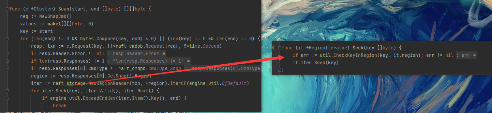

- [Project3](#project3)
  - [Project3A](#project3a)
    - [LeaderTransfer](#leadertransfer)
    - [Add / Remove](#add--remove)
    - [3A 疑难杂症](#3a-疑难杂症)
  - [Project3B](#project3b)
    - [LeaderTransfer](#leadertransfer-1)
    - [Add / Remove](#add--remove-1)
    - [节点增删的流程](#节点增删的流程)
    - [Split](#split)
      - [Split 触发](#split-触发)
      - [Split 应用](#split-应用)
    - [3B 疑难杂症](#3b-疑难杂症)
  - [Project3C](#project3c)
    - [processRegionHeartbeat](#processregionheartbeat)
    - [Schedule](#schedule)

# Project3

该节为整个项目中最难的一部分，要实现集群的 Leader 转换与动态扩缩容，包括 peer 的 Add/Remove 以及 region 的 split。

## Project3A

> Implement membership change and leadership change to Raft algorithm.

整个项目最最难的就是 project3B，但是 project3A 相比之下就简单很多，因为他只是对 project3B 的一个铺垫，只需要更改 raft 层，并且连接测试都是线性的，很好调试。project3 实现集群的扩缩容以及 transferLeader，project3A 即在 raft 层进行一些更改。

### LeaderTransfer

首先，raft 层多了两种 MsgType 为 MessageType_MsgTransferLeader 和 MessageType_MsgTimeoutNow。上层会发送该消息给 leader，要求其转换 leader，不过 project3a 没有上层，全是在 raft 层内部测试的。当 leader 要转换时，首先需要把 r.leadTransferee 置为 m.From，表明转换操作正在执行。接着，会判断目标节点的日志是否和自己一样新，如果是，就给它发一个 MsgTimeoutNow，如果不是，就先 append 同步日志，然后再发送 MsgTimeoutNow。当节点收到 MsgTimeoutNow 后，立刻开始选举，因为它的日志至少和原 leader 一样新，所以一定会选举成功。当 leader 正在进行转换操作时，所有的 propose 请求均被拒绝。

### Add / Remove

在 raft 层中，这两各操作仅仅会影响到 r.Prs[ ]，因此新增节点就加一个，删除节点就少一个。

需要注意的是，在 removeNode 之后，Leader 要重新计算 committedIndex。正常情况下，节点收到 appendEntry 会返回一个 appendResponse，当 Leader 收到这个 appendResponse 时会视情况更新自己的 committedIndex。但是呢，如果在节点返回 appendResponse 就被 removeNode 了，那么 leader 就不知道本次 entries 的同步情况了，也就不会再去重算 committedIndex。

在 TestCommitAfterRemoveNode3A 中，节点1（Leader）发送 entry3 给节点2，节点2还没有给回应就被 removeNode 了。此时集群中只剩一个节点，那么 entry3 肯定是算作大多数节点同步了的，理应被纳入 committedIndex 中，但是由于 leader 没有收到 appendResponse ，就不会更新 committedIndex ，导致出错。解决办法是，在 removeNode 之后，直接重算 committedIndex，当然也不能忘了向集群同步。

### 3A 疑难杂症

**非 Leader 收到 MsgTransfer 之后要移交给 Leader**

- 非 Leader 节点无法进行 LeaderTransfer，但是应该把收到的 MsgTransfer 发送给自己的 Leader，从而保证集群的 Leader 转移。

**创建已存在节点或删除已存在的节点时不要抛异常，直接返回就行**

- 在 TestRawNodeProposeAddDuplicateNode3A 中，会创建一个已经存在的节点，如果这时候抛异常，那就错了，正确的做法是直接返回

## Project3B

> Implement conf change and region split on Raft store.

project3B 要实现 project3A 的上层操作，即 LeaderTransfer 和 Add / Remove 的具体应用，涉及到 ConfChange。同时，3B 还要实现 region 的 split。

### LeaderTransfer

LeaderTransfer 会作为一条 Admin 指令被 propose，直接调用d.RaftGroup.TransferLeader() 方法即可，它会通过 Step() 传递一个 MsgTransferLeader 到 raft 层中。LeaderTransfer 不需要被 raft 确认，是单边发起的，直接 Leader 接收到了 MsgTransferLeader，直接开启转换。整个处理流程如下：

1. 收到 AdminCmdType_TransferLeader 请求，调用 d.RaftGroup.TransferLeader() 发送 MsgTransferLeader  到 raft 层；
2. 先判断自己是不是 Leader，因为只有 Leader 才有权利转移，否则直接忽略；
3. 判断自己的 leadTransferee 是否为空，如果不为空，则说明已经有 Leader Transfer 在执行。我们采用强制最新的原则，直接覆盖原来的 leadTransferee，不管其是否执行成功；
4. 如果目标节点拥有和自己一样新的日志，则发送 pb.MessageType_MsgTimeoutNow 到目标节点。否则启动 append 流程同步日志。当同步完成后再发送 pb.MessageType_MsgTimeoutNow；
5. 当 Leader 的 leadTransferee 不为空时，不接受任何 propose，因为正在转移；
6. 如果在一个 electionTimeout 时间内都没有转移成功，则放弃本次转移，重置 leadTransferee 为 None。因为目标节点可能已经挂了；
7. 目标节点收到 pb.MessageType_MsgTimeoutNow 时，应该立刻自增 term 开始选举；

LeaderTransfer 之所以能成功，核心原因是目标节点的日志至少和旧 Leader 一样新，这样在新一轮选举中，目标节点就可以顺利当选 Leader。

### Add / Remove

和其他 cmd 的 propose 不一样，该指令是通过 d.RaftGroup.ProposeConfChange() 提交的，除此之外 propose 流程和其他 cmd 的大同小异。

应用的流程如下：

1. 调用 d.RaftGroup.ApplyConfChange() 方法，修改 raft 内部的 peers 信息，其会调用 3A 中实现的 Add 和 Remove；
2. 修改 region.Peers，是删除就删除，是增加就增加一个 peer。如果删除的目标节点正好是自己本身，那么直接调用 d.destroyPeer() 方法销毁自己，并直接返回；
3. 令 region.RegionEpoch.ConfVer ++ ；
4. 持久化修改后的 Region，写到 kvDB 里面。使用 meta.WriteRegionState() 方法。其中 state 要使用 rspb.PeerState_Normal，因为其要正常服务请求的；
5. 调用 d.insertPeerCache() 或 d.removePeerCache() 方法，更新缓存；
6. 更新 scheduler 那里的 region 缓存，否则可能遇见 no region 的错误。实现代码如下：

``` go
func (d *peerMsgHandler) notifyHeartbeatScheduler(region *metapb.Region, peer *peer) {
  clonedRegion := new(metapb.Region)
  err := util.CloneMsg(region, clonedRegion)
  if err != nil {
    return
  }
  d.ctx.schedulerTaskSender <- &runner.SchedulerRegionHeartbeatTask{
    Region:          clonedRegion,
    Peer:            peer.Meta,
    PendingPeers:    peer.CollectPendingPeers(),
    ApproximateSize: peer.ApproximateSize,
  }
}
```

### 节点增删的流程

以上描述了 Add、Remove 需要我们写的函数的具体实现，本小节将整体性的去梳理集群增删节点的流程，从 cluster 企图增删节点开始，这一部分大多不需要我们来实现，但理解他们至关重要。

从测试代码开始梳理，研究以下内容：

```go
func TestBasicConfChange3B(t *testing.T) {
	cfg := config.NewTestConfig()
	cluster := NewTestCluster(5, cfg)
	cluster.Start()
	defer cluster.Shutdown()

	cluster.MustTransferLeader(1, NewPeer(1, 1))
	cluster.MustRemovePeer(1, NewPeer(2, 2))
	cluster.MustRemovePeer(1, NewPeer(3, 3))
	cluster.MustRemovePeer(1, NewPeer(4, 4))
	cluster.MustRemovePeer(1, NewPeer(5, 5))
    // ...
}
```

这几句的目的很显然，启动集群（初始有 5 个节点），将 Leader 转移，然后删掉四个。进入 MustRemovePeer 中查看删除操作，发现其调用 c.schedulerClient.RemovePeer，如下：

```go
func (c *Cluster) MustRemovePeer(regionID uint64, peer *metapb.Peer) {
	c.schedulerClient.RemovePeer(regionID, peer)
	c.MustNonePeer(regionID, peer)
}
```

这里就引入了一个很重要的角色，schedulerClient。我们知道，从 raft 一直到 peerMsgHandler（甚至说到更上层），都是一个 peer 一个，也就是说集群有多个 peer 就有多少个。但是 Cluster 不一样，它只有一个，代表整个集群，所有的 region 共用，相应的，schedulerClient 也只有一个，负责整个集群的调度操作，其中就包括 Add、Remove 。如果写完 3C，会知道它负责的内容还会更多。

那么进入 RemovePeer 去看一下，发现其操作非常简单，就是把 m.operators[regionID] 赋个值，增加就给 Add，删除就给 Remove ，转移就给 Transfer。

```go
func (m *MockSchedulerClient) RemovePeer(regionID uint64, peer *metapb.Peer) {
	m.scheduleOperator(regionID, &Operator{
		Type: OperatorTypeRemovePeer,
		Data: &OpRemovePeer{
			peer: peer,
		},
	})
}

func (m *MockSchedulerClient) scheduleOperator(regionID uint64, op *Operator) {
	m.Lock()
	defer m.Unlock()
	m.operators[regionID] = op
}
```

也就是说，cluster.MustRemovePeer 只是赋了个值，并不是真正下发删除指令的入口，那么入口在哪呢？很容易想到，一定有个函数会不时的询问 m.operators ，一旦有刚赋过来的操作就立刻下发指令，以此保证 MustRemovePeer 的正确性。这个询问者才是真正的入口函数，名为 RegionHeartbeat。

实际上，写到 Project3C 就知道，scheduler 通过处理集群发来的心跳（注意，这个和 raft 同步的心跳不是一个东西）来时刻监控集群的状态，这一部分应该在 3C 需要我们自己完成，但是在 3B 它帮我们写好了，所以这个 scheduler 名为 MockSchedulerClient（Mock，模拟），就是为了测试 3B 而存在的 scheduler。RegionHeartbeat 就是这个 scheduler 用来监控并执行相关操作的函数。cluster 一定会不时的去调用 RegionHeartbeat 从而对集群进行操作，只不过，在哪调用我暂时没找到（尴尬）。

我们看下 RegionHeartbeat 的核心部分：

```go
func (m *MockSchedulerClient) RegionHeartbeat(req *schedulerpb.RegionHeartbeatRequest) error {
    // ...
	if op := m.operators[regionID]; op != nil {
		if m.tryFinished(op, req.Region, req.Leader) {
			delete(m.operators, regionID)
		} else {
			m.makeRegionHeartbeatResponse(op, resp)
		}
		log.Debugf("[region %d] schedule %v", regionID, op)
	}
    
    store := m.stores[req.Leader.GetStoreId()]
	store.heartbeatResponseHandler(resp)
    // ...
}
```

其会找到 RemovePeer 赋值的 operator，然后通过 tryFinished 检查该操作是否已经完成，如果是就删除掉，留出位置给下一次操作赋值。如果否，那么就调用 makeRegionHeartbeatResponse 来取出该操作，将其包装为 resp，如下：

```go
func (m *MockSchedulerClient) makeRegionHeartbeatResponse(op *Operator, resp *schedulerpb.RegionHeartbeatResponse) {
	switch op.Type {
	case OperatorTypeAddPeer:
		add := op.Data.(*OpAddPeer)
		if !add.pending {
			resp.ChangePeer = &schedulerpb.ChangePeer{
				ChangeType: eraftpb.ConfChangeType_AddNode,
				Peer:       add.peer,
			}
		}
	case OperatorTypeRemovePeer:
		remove := op.Data.(*OpRemovePeer)
		resp.ChangePeer = &schedulerpb.ChangePeer{
			ChangeType: eraftpb.ConfChangeType_RemoveNode,
			Peer:       remove.peer,
		}
	case OperatorTypeTransferLeader:
		transfer := op.Data.(*OpTransferLeader)
		resp.TransferLeader = &schedulerpb.TransferLeader{
			Peer: transfer.peer,
		}
	}
}
```

看见 ConfChangeType_XXX 就熟悉起来了，就是 3B 中新加的类型。makeRegionHeartbeatResponse 完成之后，取出 region 中的 Leader，也就是代码中的 store，然后调用 heartbeatResponseHandler 执行 resp。heartbeatResponseHandler  实际是个函数指针，在集群启动时才将其赋为某个具体函数，该函数如下：

```go
func (r *SchedulerTaskHandler) onRegionHeartbeatResponse(resp *schedulerpb.RegionHeartbeatResponse) {
	if changePeer := resp.GetChangePeer(); changePeer != nil {
		r.sendAdminRequest(resp.RegionId, resp.RegionEpoch, resp.TargetPeer, &raft_cmdpb.AdminRequest{
			CmdType: raft_cmdpb.AdminCmdType_ChangePeer,
			ChangePeer: &raft_cmdpb.ChangePeerRequest{
				ChangeType: changePeer.ChangeType,
				Peer:       changePeer.Peer,
			},
		}, message.NewCallback())
	} else if transferLeader := resp.GetTransferLeader(); transferLeader != nil {
		r.sendAdminRequest(resp.RegionId, resp.RegionEpoch, resp.TargetPeer, &raft_cmdpb.AdminRequest{
			CmdType: raft_cmdpb.AdminCmdType_TransferLeader,
			TransferLeader: &raft_cmdpb.TransferLeaderRequest{
				Peer: transferLeader.Peer,
			},
		}, message.NewCallback())
	}
}
```

欸，到这里就明晰了，最终是通过 sendAdminRequest 将 Add、Remove 封装为 AdminRequest，之后会被进一步封装为 RaftCmdRequest，然后就是通过熟悉 proposeRaftCommand 将指令下发给 Leader 了。

至此，Add、Remove 的下发流程就梳理完毕了，也就是仍然通过 entry -> HandleRaftReady 的方式来执行，既然如此，那必然需要同步（Transfer 除外，它是唯一一个不需要同步的指令），即所有节点都要执行。接下来就梳理一下执行流程。

我们先以 Remove 为例，假设集群（单 region）有 5 个节点 A B C D E。当上层想要删除节点 E 时，会下发一个 RaftCmdRequest 给集群来同步，在 entry 完成同步之前，集群中仍然是这个 5 个节点，没少。接下来，5 个节点同步完成，相继通过 handleRaftReady 来执行 Remove。对于节点 A B C D 而言，它们会从下到上更改自己认知的 peers 信息，包括 3A 中写的 raft 层、更上层的 Region() 信息、GlobalContext 的 storeMeta 等等，细节涉及代码实现，不赘述了。而对于节点 E 而言，当发现要删的节点就是自己时，它就会调用 destroyPeer 来销毁自己。至此，节点 E 脱离集群，同时其余节点认知中也不再存在 E，Remove 执行完毕。

接下来看 Add。首先看上层下发时传入的参数：

```go
cluster.MustAddPeer(1, NewPeer(2, 2))
```

NewPeer，仅仅有 sotreId 和 peerID。也就是说，Add 只是新增空节点，而不是恢复之前 Remove 的节点，二者没有直接联系。不妨称新的节点为 F，和 Remove 一样，Add 请求被封装为 entry 在 A B C D 中同步，然后在 handleRaftReady 中解封装为 RaftCmdRequest 执行。直到此刻，集群啊还是 A B C D，没有 F。梳理 Add 流程的关键在于，F 何时会出现。

和 Remove 类似，A B C D 会从下至上更改自己认知的 peers 信息，也即，它们认为有 F 了。但不同于 Remove 在 handleRaftReady 完成之后也就完成了，Add 在 handleRaftReady 之后还有一段路要走，因为此时只是现有节点**认为**有个新节点为 F，但实际上，F 根本就没有创建。

接下来探讨 F 何时创建，我们将视角转到 Leader（假设为 A） 。此时，A 的 peers 中有 F，那么它就会给 F 发送心跳 Msg。重点来了，每一个要发送的 Msg 会先经过一个名为 onRaftMessage 的函数，该函数的主要作用是检查。要检查的内容很多， 其中一项就是检查 Msg.To 是否存在。各种检查之后，会调用 maybeCreatePeer 函数，该函数才是真正创造 F 的入口。

```go
func (d *storeWorker) onRaftMessage(msg *rspb.RaftMessage) error {
	// ... 各种检查
	created, err := d.maybeCreatePeer(regionID, msg)
    // ...
}
```

如何走到这一步，代码有点冗长，直接说结论，当 Msg 为心跳、Msg.Commit == util.RaftInvalidIndex 且 Msg.To 不存在，三个条件满足就会走到这一步。很明显，A 发送给 F 的心跳 Msg，满足它们。

接下来看 maybeCreatePeer，直接看最核心的部分：

```go
func (d *storeWorker) maybeCreatePeer(regionID uint64, msg *rspb.RaftMessage) (bool, error) {
    // ...
	peer, err := replicatePeer(
		d.ctx.store.Id, d.ctx.cfg, d.ctx.regionTaskSender, d.ctx.engine, regionID, msg.ToPeer)
	if err != nil {
		return false, err
	}
	// following snapshot may overlap, should insert into regionRanges after
	// snapshot is applied.
	meta.regions[regionID] = peer.Region()
	d.ctx.router.register(peer)
	_ = d.ctx.router.send(regionID, message.Msg{Type: message.MsgTypeStart})
	return true, nil
    // ...
}
```

上述代码才是真正创建 F 并将其注册进集群的，此时，集群才成为 A B C D F。

Add 操作到此位置，F 加入完毕。但还有一个重要问题没有解决，那就是 F 的信息同步问题了。F 刚加进来，什么都不知道，就连 Region() 都是空的（这点可以看 replicatePeer），也就是说 F 所认知的 region 信息和其余四个相比完全落后。因此，我们要更改 F 对 region 的认知，使它和其余四个一致，或者说，和 Leader 一致。这个问题的答案，TinyKV 文档会给我们提示：

> The leader then will know this Follower has no data (there exists a Log gap from 0 to 5) and it will directly send a snapshot to this Follower

也即，A 即刻会发现 F 日志落后了，随机给它发送 snapshot。当 F 收到 snapshot 之后，会递交给 handleRaftReady 中应用，而 F.Region() 的更新，就是在 snapshot 的应用中完成的。F 的 handleRaftReady 收到 snapshot 之后，会调用 SaveReadyState 来应用，而 SaveReadyState 实际是调用 ApplySnapshot 来应用，这是 2C 的内容，大家都知道。

SaveReadyState 执行完毕后会返回 applySnapRet。F 就是通过 applySnapRet 来更新自己的 region 信息以及 GlobalContext.storeMeta 的 。所以重点就在于，ApplySnapshot 是如何生成 applySnapRet 的，这是大家要对 2C 代码部分进行的更改。

至此，F 的 region 信息同步完毕，集群正式更新为 A B C D F。

### Split

3B 要实现 Split，即将一个 region 一分为二，降低单个 region 的存储压力。当 regionA 容量超出 Split 阀值时触发 Split 操作，按照 Split Key 将 regionA 按照 Key 的字典序一分为二，成为 regionA 和 regionB，从此 regionA 、regionB 为两个独立的 region。


原本 0~100 的范围里面只能使用一个 Raft Group 处理请求，然后将其一分为二为两个 region，每个处理 50 个 Key，就可以用两个 Raft Group，能提升访问性能。

#### Split 触发

1. `peer_msg_handler.go` 中的 onTick() 定时检查，调用 onSplitRegionCheckTick() 方法，它会生成一个 SplitCheckTask 任务发送到 split_checker.go 中;
2. 检查时如果发现满足 split 要求，则生成一个 MsgTypeSplitRegion 请求;
3. 在 `peer_msg_handler.go` 中的 HandleMsg() 方法中调用 onPrepareSplitRegion()，发送 SchedulerAskSplitTask 请求到 scheduler_task.go 中，申请其分配新的 region id 和 peer id。申请成功后其会发起一个 AdminCmdType_Split 的 AdminRequest 到 region 中。
4. 之后就和接收普通 AdminRequest 一样，propose 等待 apply。注意 propose 的时候检查 splitKey 是否在目标 region 中和 regionEpoch 是否为最新，因为目标 region 可能已经产生了分裂；

#### Split 应用

1. 基于原来的 region clone 一个新 region，这里把原来的 region 叫 oldRegion，新 region 叫 newRegion。复制方法如下：
   1. 把 oldRegion 中的 peers 复制一份；
   2. 将复制出来的 peers 逐一按照 req.Split.NewPeerIds[i] 修改 peerId，作为 newRegion 中的 peers，记作 cpPeers；
   3. 创建一个新的 region，即 newRegion。其中，Id 为 req.Split.NewRegionId，StartKey 为 req.Split.SplitKey，EndKey 为 d.Region().EndKey，RegionEpoch 为初始值，Peers 为 cpPeers；
2. oldRegion 的 EndKey 改为 req.Split.NewRegionId；
3. oldRegion 和 newRegion 的 RegionEpoch.Version 均自增；
4. 持久化 oldRegion 和 newRegion 的信息；
5. 更新 storeMeta 里面的 regionRanges 与 regions；
6. 通过 createPeer() 方法创建新的 peer 并注册进 router，同时发送 message.MsgTypeStart 启动 peer；
7. 调用两次 d.notifyHeartbeatScheduler()，更新 scheduler 那里的 region 缓存；

### 3B 疑难杂症

**leaderTransfee 只有在角色成功转换之后才置 None**

- 只有 Leader 成功转换为 Candidate 或是 Follower 时，leaderTransfer 才算成功。如果过早置 None，上层提交的 entry 很可能直接给了旧的 leader，导致无法同步。

**sendHeartbeat的时候 msg.Commit 要填 util.RaftInvalidIndex**

- 首先要理解 peer 的创建时机。我们执行 Entry_Config 其实仅仅是修改各种状态，而不是创建 peer，创建 peer 的操作在 store_worker.go 中进行。在 store_worker.go 的 onRaftMessage() 方法中可以看到，当目标的 peer 不存在时，它会调用 d.maybeCreatePeer() 尝试创建 peer。而在 d.maybeCreatePeer() 中，有个 util.IsInitialMsg() 判断，如下：

``` go
if !util.IsInitialMsg(msg.Message) {
    log.Debugf("target peer %s doesn't exist", msg.ToPeer)
    return false, nil
}
```

- 这个部分用来判断 msg 是否初始化了，如果没有，那就直接 return 回去，不创建 peer 了，那就看看是怎么做初始化判断的：

``` go
func IsInitialMsg(msg *eraftpb.Message) bool {
	return msg.MsgType == eraftpb.MessageType_MsgRequestVote ||
		// the peer has not been known to this leader, it may exist or not.
		(msg.MsgType == eraftpb.MessageType_MsgHeartbeat && msg.Commit == RaftInvalidIndex)
}
```

- 可以看到，如果 Leader 要发送 heartbeat，那么其 msg.Commit 字段一定要是 RaftInvalidIndex（实际上就是 0），只有满足这个条件才算作初始化，才会继续后续步骤来创建原本不存在的 peer。

**执行完 enrtyConf 之后别忘了对 d.stopped 判断，然后再写入 applyState**

- 首先，在 HandleRaftReady 刚开始就要进行一次 d.stopped 判断，防止宕机节点继续执行指令。但是在执行完 enrtyConf 之后，还要进行一遍 d.stopped 判断，因为其有可能通过 removeNode 把自己删了，如果不进行这个判断，就会继续执行后续的 entry，显然是错的。如果执行完 enrtyConf 之后 d.stopped == true，直接返回即可。

**修改 RegionState 的时候不要忘了加锁**

- 这是个临界资源，一定要加锁，不加后面可能会发现它的值和预期不一样。

**meta corruption detected**

- 直观来看，就是从 regionRange 中 Delete 的 Peer 本就不存在，然后就出这个错。在测试点中，一旦 add Peer，然后 delete 这个新的 peer，就会出这个错误。原因如下一点所述：

**deleteNode 不需要自己从 regionRanges 删，但是 addNode 需要**

- 每次 add 或是 delete 时，regionRanges 都要相应的变动。在执行 deleteNode 时，会调用 destroyPeer()，其已经帮实现了从 regionRanges 中 delete，所以无需另行实现。但是 add 就不一样了。addNode 最后会通过 replicatePeer() 创建 Peer，但是这个方式是没有实现从 regionRanges 中 Add 的，所以在执行 addNode 时需要我们手动更改 regionRanges。

**执行 entry 时需要另做 regionEpoch 检查，尤其是 snap**

- 在执行 entry 之前，集群有可能发生变换（add、delete、split），这样一来 regionEpoch 落后的 entry 就应该丢弃不执行。

- 实际上在接受 msg 时，onRaftMsg() 已经帮忙对 msg 做了 regionEpoch 检查，但是这不代表在执行 entry 时它的 regionEpoch 就是最新的，因为在接受 msg 和 执行 entry 之间的时段中集群也有可能发生变化，所以需要再检查一遍。

- 奇怪的是，我在执行其他命令时没有进行这个检查，但是一路也没有什么错，唯独 snapEntry 不进行检查的话会出错。这是因为测试点在 Scan 时，会通过 Seek 在 region 的迭代器中查找传入的 key，Seek 则调用 CheckKeyInRegion 对传入的 key 进行检查，如下：



- 如果执行的 snapEntry 是个过期的（region 又被 split 了），那么这个 key 很可能就不在当前的 region 中了，就会出错。 为了避免类似的错误，我在执行任何 entry 之前，都会进行 regionEpoch  检查。

## Project3C

> Implement a basic scheduler.

project3C 要实现上层的调度器。

### processRegionHeartbeat

首先要实现的是一个 processRegionHeartbeat()，用来让集群调度器同步 regions 信息。每个 region 都会周期性的发送心跳给调度器，调度器会检查收到心跳中的region 信息是否合适，如果合适，以此更新自己的记录的 regions 信息。至于怎么检查，怎么跟新，官方文档里写的很清晰，这里不再赘述。
需要提的一点时，当调度器收到了新的 region 心跳（即自己没记录这个region），就要先获取所有包含该 regoin 的 region（ start_key ~ end_key ），然后这个新的 region 必须要比全部的后者都要新，才能够仍为他是合适的。新旧判断直接调用 util.IsEpochStale() 即可。

### Schedule

接下来实现 region 调度，该部分用来让集群中的 stores 所负载的 region 趋于平衡，避免一个 store 中含有很多 region 而另一个 store 中含有很少 region 的情况。流程官方文档也说的很清楚，大致如下：

1. 选出 DownTime() < MaxStoreDownTime 的 store 作为 suitableStores，并按照 regionSize 降序排列；
2.  获取 regionSize 最大的 suitableStore，作为源 store，然后依次调用 GetPendingRegionsWithLock()、GetFollowersWithLock()、GetLeadersWithLock()，如果找到了一个待转移 region，执行下面的步骤，否则尝试下一个 suitableStore；
3.  判断待转移 region 的 store 数量，如果小于 cluster.GetMaxReplicas()，放弃转移；
4.  取出 regionSize 最小的 suitableStore 作为目标 store，并且该 store 不能在待转移 region 中，如果在，尝试次小的 suitableStore，以此类推；
5.  判断两 store 的 regionSize 差别是否过小，如果是（< 2*ApproximateSize），放弃转移。因为如果此时接着转移，很有可能过不了久就重新转了回来；
6.  在目标 store 上创建一个 peer，然后调用 CreateMovePeerOperator 生成转移请求；