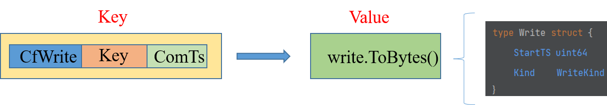
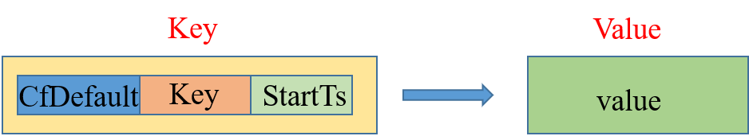

- [Project4](#project4)
  - [2PC](#2pc)
    - [数据写入](#数据写入)
      - [Prewrite](#prewrite)
      - [Commit](#commit)
    - [数据读取](#数据读取)
    - [Rollback](#rollback)
  - [Project4A](#project4a)
    - [GetValue](#getvalue)
    - [CurrentWrite](#currentwrite)
    - [MostRecentWrite](#mostrecentwrite)
  - [Project4B](#project4b)
    - [KvGet](#kvget)
    - [KvPrewrite](#kvprewrite)
    - [KvCommit](#kvcommit)
  - [Project4C](#project4c)
    - [KvScan](#kvscan)
    - [KvCheckTxnStatus](#kvchecktxnstatus)
    - [KvBatchRollback](#kvbatchrollback)
    - [KvResolveLock](#kvresolvelock)

# Project4

project4 用来实现分布式事务的原子性，核心就是 2PC

## 2PC

Percolator 提供了 5 种 Column Family 分别为 lock，write，data，notify，ack_O。在 TinyKV 中我们只需要使用 Lock，Write 和 Data。其中 Data 使用 Default 替代。四个 CF 意义分别为：

- Default：实际的数据，存在多版本，版本号就是写入事务的 startTs，一个版本对应一次写入；
- Lock：锁标记，版本号就是写入事务的 startTs，同时每一个 lock 上含有 primary key 的值；
- Write：Write 上存在 startTs 和 commitTs，startTs 是指向对应 Data 中的版本，commitTs 是这个 Write 的创建时间；

一个事务要保证自身写的操作不会被别的事务干扰（防止写写冲突），也就是事务 T1 在修改 A 的时候，别的事务就不能修改 A。Percolator 在所有的 key 上加了 lock，而 lock 里面含有 primary key 信息，也就是将这些锁的状态和 primary key 绑定。Primary key 的 lock 在，它们就在；Primary key 的 lock 不在，那么它们的 lock 也不能在。

Primary key 是从写入的 keys 里面随机选的，在 commit 时需要优先处理 primary key。 当 primary key 执行成功后，其他的 key 可以异步并发执行，因为 primary key 写入成功代表已经决议完成了，后面的状态都可以根据 primary key 的状态进行判断。

### 数据写入

2PC 将数据的提交分为两段，一段为 prewrite，另一段为 commit。所有写入的数据会先被保存在 client 缓存中，只有当提交时，才触发上述两段提交。

#### Prewrite

1. 检查要写入的 key 是否存在大于 startTs 的 Write，如果存在，直接放弃，说明在事务开启后，已经存在写入并已提交，也就是存在写-写冲突；
2. 检查要写入 key 的数据是否存在 Lock（任意 startTs下的 Lock），即检测是否存在写写冲突，如果存在直接放弃；
3. 如果通过上面两项检查，写入 Lock 和 Data，时间戳为你的 startTs。Lock 里面包含着 primary key 信息；

为什么第2步要检查任意 startTs 下的 Lock：

- Lock 的 startTs 小于当前事务的 startTs：如果读了，就会产生脏读，因为前一个事务都没有 commit 就读了。
- Lock 的 startTs 大于当前事务的 startTs：如果读了并修改了然后提交，拥有这个 lock 的事务会产生不可重复读。
- Lock 的 startTs 等于当前事务的 startTs：不可能发生，因为当重启事务之后，是分配一个新的 startTs，不可能使用一个过去的 startTs 去执行重试操作；

#### Commit

1. 从中心授时器获取一个 commitTs；
2. 检查 key 的 lock 的时间戳是否为事务的 startTs，不是直接放弃。因为存在如下可能，致使 Key 可能存在不属于当前事务的 Lock
   - 在当前 commit 的时候，前面的 prewrite 操作由于网络原因迟迟未到，导致 key 并没有加上该事务的锁。
   - 在当前 commit 的时候，前面的 prewrite 操作因为过于缓慢，超时，导致你的 lock 被其他事务 rollback 了。
3. 新增一条 Write，写入的 Write 包含了 startTs  和 commitTs，startTs 的作用是帮助你查找对应的 Default；
4. 删除其对应的 lock；

Commit 时应该首先对 primary key 执行上述操作，primary key 执行完毕后才能对其余的 key 执行 commit。

### 数据读取

1. 读取某一个 key 的数据，检查其是否存在小于或等于 startTs 的 lock，如果存在说明在本次读取时还存在未 commit 的事务，先等一会，如果等超时了 lock 还在，则尝试 rollback。如果直接强行读会产生脏读，读取了未 commit 的数据；
2. 查询 commitTs 小于 startTs 的最新的 Write，如果不存在则返回数据不存在；
3. 根据 Write 的 startTs 从 Default 中获取数据；

### Rollback

回滚操作由 Primary key 的状态决定，存在如下四种情况：

1. Primary key 的 Lock 还在，并且是待回滚事务的，代表之前的事务没有 commit，就选择回滚，通过 Write 给一个 rollback 标记；
2. Primary key 上面的 Lock 已经不存在，且有了 Write，那么代表 primary key 已经被 commit 了，这里我们选择继续推进 commit；
3. Primary key 既没有 Lock 也没有 Write，那么说明之前连 Prewrite 阶段都还没开始，客户端重试即可；
4. Primary key 的 Lock 还在，但并不是当前事务的，也即被其他事务 Lock 了，这样的话就 Write 一个 rollback 标记，然后返回即可；

为什么第 4 种情况下，key 被其他事务 Lock 了，仍然要给 rollback 标记？

- 在某些情况下，一个事务回滚之后，TinyKV 仍然有可能收到同一个事务的 prewrite 请求。比如，可能是网络原因导致该请求在网络上滞留比较久；或者由于 prewrite 的请求是并行发送的，客户端的一个线程收到了冲突的响应之后取消其它线程发送请求的任务并调用 rollback，此时其中一个线程的 prewrite 请求刚好刚发出去。也就是说，被回滚的事务，它的 prewrite 可能比 rollback 还要后到。
- 如果 rollback 发现 key 被其他事务 lock 了，并且不做任何处理。那么假设在 prewrite 到来时，这个 lock 已经没了，由于没有 rollback 标记，这个 prewrite 就会执行成功，则回滚操作就失败了。如果有 rollback 标记，那么 prewrite 看到它之后就会立刻放弃，从而不影响回滚的效果。
- 另外，打了 rollback 标记是没有什么影响的，即使没有上述网络问题。因为 rollback 是指向对应 start_ts 的 default 的，也就是该事务写入的 value，它并不会影响其他事务的写入情况，因此不管它就行。

## Project4A

> Implement the multi-version concurrency control layer.

project4A 实现一些基本操作，比如获取 value、给 lock、给 write 等等，供 project4B/C 调用，要完善的文件为 `transaction.go`。在进行具体实现之前，需要先了解三个前缀的结构：

**Lock**

Lock 的 Key 仅仅由 Cf_Lock 和源 Key 拼接而成，不含 Ts 信息。Lock 的 Ts 信息同 Ttl、Kind、Primary Key 一并存在 Value 中。

**Write**

不同于 Lock，Write 的 Key 中是整合了 commitTs 的，首先通过 EncodeKey 将源 Key 和 commitTs 编码在一起，然后和 Cf_Write 拼接形成新的 Key。Write 的 StartTs 同 Kind 一并存在 Value 中。

**Default**

不同于 Write，Default 的 Key 中整合的是 startTs，而不是 commitTs，用于 Write 进行索引，写入的值存在 Value 中即可。 

了解完结构后，基本的写入和读取操作就很简单了，这里不再赘述，着重将三个方法：

### GetValue

查询当前事务下，传入 key 对应的 Value。

1. 通过 iter.Seek(EncodeKey(key, txn.StartTS)) 查找遍历 Write，找到 commitTs <= ts 最新 Write；
2. 判断找到 Write 的 key 是不是就是自己需要的 key，如果不是，说明不存在，直接返回；
3. 判断 Write 的 Kind 是不是 WriteKindPut，如果不是，说明不存在，直接返回；
4. 从 Default 中通过 EncodeKey(key, write.StartTS) 获取值；

### CurrentWrite

查询当前事务下，传入 key 的最新 Write。

1. 通过 iter.Seek(EncodeKey(key, math.MaxUint64)) 查询该 key 的最新 Write；
2. 如果 write.StartTS > txn.StartTS，继续遍历，直到找到 write.StartTS == txn.StartTS 的 Write；
3. 返回这个 Write 和 commitTs；

### MostRecentWrite

查询当前事务下，传入 key 的最新 Write。

1. 通过 iter.Seek(EncodeKey(key, math.MaxUint64)) 查找；
2. 判断目标 Write 的 key 是不是我们需要的，不是返回空，是直接返回该 Write；

## Project4B

> Implement handlers of KvGet, KvPrewrite, and KvCommit requests.

project4B 主要实现事务的两段提交，即 prewrite 和 commit，需要完善的文件是 `server.go`。要注意的是，这要需要通过 server.Latches 对 keys 进行加锁。

### KvGet

获取单个 key 的 Value。

1. 通过 Latches 上锁对应的 key；
2. 获取 Lock，如果 Lock 的 startTs 小于当前的 startTs，说明存在你之前存在尚未 commit 的请求，中断操作，返回 LockInfo；
3. 否则直接获取 Value，如果 Value 不存在，则设置 NotFound = true；

### KvPrewrite

进行 2PC 阶段中的第一阶段。

1. 对所有的 key 上锁；
2. 通过 MostRecentWrite 检查所有 key 的最新 Write，如果存在，且其 commitTs 大于当前事务的 startTs，说明存在 write conflict，终止操作；
3. 通过 GetLock() 检查所有 key 是否有 Lock，如果存在 Lock，说明当前 key 被其他事务使用中，终止操作；
4. 到这一步说明可以正常执行 Prewrite 操作了，写入 Default 数据和 Lock；

### KvCommit

进行 2PC 阶段中的第二阶段。

1. 通过 Latches 上锁对应的 key；
2. 尝试获取每一个 key 的 Lock，并检查 Lock.StartTs 和当前事务的 startTs 是否一致，不一致直接取消。因为存在这种情况，客户端 Prewrite 阶段耗时过长，Lock 的 TTL 已经超时，被其他事务回滚，所以当客户端要 commit 的时候，需要先检查一遍 Lock；
3. 如果成功则写入 Write 并移除 Lock；

## Project4C

> Implement handlers of KvScan, KvCheckTxnStatus, KvBatchRollback, and KvResolveLock requests.

project4C 要在 project4B 的基础上，实现扫描、事务状态检查、批量回滚、清除锁这四个操作。

### KvScan

该方法要基于 project1 中的 iter 生成一个新的迭代器，不同于 project1，在 project4 中 key 是整和了 ts 的，所以这里的迭代器要把这个 ts 抽出来，只返回原有的 key 和对应的 value，如下：

### KvCheckTxnStatus

用于 Client failure 后，想继续执行时先检查 Primary Key 的状态，以此决定是回滚还是继续推进 commit。

1. 通过 CurrentWrite() 获取 primary key 的 Write，记为 write。通过 GetLock() 获取 primary key 的 Lock，记为 lock；
2. 如果 write 不是 WriteKindRollback，则说明已经被 commit 了，不用管，直接返回 commitTs
3. 如果 lock 为 nil，进入如下操作：
   1. 如果 write 为 WriteKindRollback，则说明已经被回滚了，因此无需操作，返回 Action_NoAction 即可；
   2. 否则，打上 rollback 标记（WriteKindRollback），返回 Action_LockNotExistRollback；
4. 如果 lock 存在，并且超时了。那么删除这个 lock，并且删除对应的 Value，同时打上 rollback 标记，然后返回 Action_TTLExpireRollback；
5. 如果 lock 存在，但是并没有超时，则直接返回，等待其自己超时；

### KvBatchRollback

用于批量回滚。

1. 首先对要回滚的所有 key 进行检查，通过 CurrentWrite 获取到每一个 key write，如果有一个 write 不为 nil 且不为 WriteKindRollback，则说明存在 key 已经提交，则拒绝回滚，将 Abort 赋值为 true，然后返回即可；
2. 通过 GetLock 获取到每一个 key 的 lock。如果 lock.Ts != txn.StartTs，则说明这个 key 被其他事务 lock 了，但仍然要给 rollback 标记，原因前文有述；
3. 如果 key 的 write 是 WriteKindRollback，则说明已经回滚完毕，跳过该 key；
4. 如果上两者都没有，则说明需要被回滚，那么就删除 lock 和 Value，同时打上 rollback 标记，然后返回即可；

### KvResolveLock

这个方法主要用于解决锁冲突，当客户端已经通过 KvCheckTxnStatus() 检查了 primary key 的状态，这里打算要么全部回滚，要么全部提交，具体取决于 ResolveLockRequest 的 CommitVersion。

1. 通过 iter 获取到含有 Lock 的所有 key；
2. 如果 req.CommitVersion == 0，则调用 KvBatchRollback() 将这些 key 全部回滚；
3. 如果 req.CommitVersion > 0，则调用 KvCommit() 将这些 key 全部提交；
